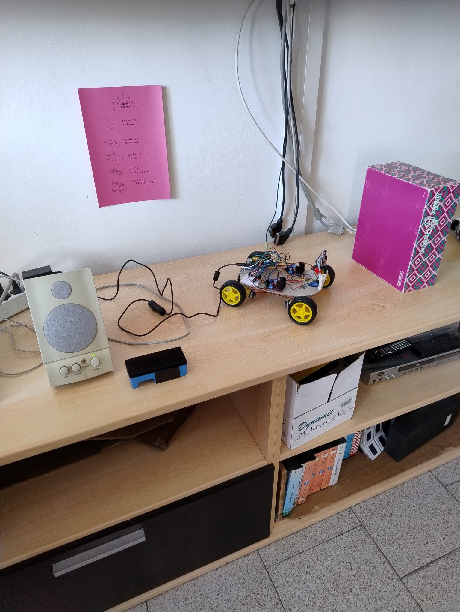

# Rover STEM – Progetto PNRR

> Corso STEM finanziato con i fondi PNRR · Docenti: **Annalisa Pazzi** & **Lisa Galvani**



## Sommario

- [Introduzione](#introduzione)
- [Obiettivi Didattici](#obiettivi-didattici)
- [Bill of Materials](#bill-of-materials)
- [Schema di Collegamento](#schema-di-collegamento)
- [Montaggio Meccanico](#montaggio-meccanico)
- [Software](#software)
- [Come Iniziare](#come-iniziare)
- [Road‑map didattica](#road-map-didattica)
- [Contribuire](#contribuire)
- [Licenza](#licenza)

---

## Introduzione

Questo repository contiene il materiale hardware e software del **Rover STEM**, un piccolo veicolo semovente a basso costo progettato durante il corso STEM promosso all’interno del *Piano Nazionale di Ripresa e Resilienza* (PNRR).

Il rover è basato su **Arduino** e utilizza due ruote motrici (più una ruota folle) pilotate attraverso un modulo **L298N**. Il progetto è pensato per:

1. introdurre gli studenti ai fondamenti di elettronica e programmazione embedded;
2. sviluppare competenze di problem‑solving e teamwork;
3. mostrare un caso concreto di robotica educativa "hands‑on".

## Obiettivi Didattici

- Saper leggere uno schema elettrico e realizzare un cablaggio su breadboard.
- Programmare Arduino in C/C++ usando l’IDE ufficiale.
- Comprendere PWM, ponti H e controllo di motori DC.
- Applicare concetti di fisica (forza, attrito, velocità) in un contesto pratico.
- Collaborare in team seguendo un flusso Git/GitHub semplificato.

## Bill of Materials

| # | Componente | Q.tà | Note |
|---|------------|------|------|
| 1 | Arduino Uno R3 (o Nano) | 1 | Clone economico OK |
| 2 | Modulo driver L298N | 1 | Doppio ponte H |
| 3 | Motoriduttori TT 3–6 V con ruota 65 mm | 2 | Ruote gialle standard |
| 4 | Ruota folle (caster) | 1 | 360° |
| 5 | Portabatterie 6 × AA con interruttore | 1 | Alimenta motori |
| 6 | Breadboard mini + jumper Dupont | — | Cablaggio senza saldature |
| 7 | Viti, distanziatori, telaio acrilico | — | Qualsiasi telaio 2WD |

Costo totale stimato: **< €40** acquistando componenti non marchiati su Amazon o AliExpress.

## Schema di Collegamento

```
6xAA 7,2–9 V → +12V L298N
               └─> GND L298N —— GND Arduino
5V Arduino —— 5V L298N

// Motore sinistro
D9 → ENA (PWM)
D8 → IN1
D7 → IN2

// Motore destro
D10 → ENB (PWM)
D6  → IN3
D5  → IN4
```

> 🔧 **Consiglio**: se non ti serve la regolazione di velocità collega ENA/ENB a +5 V tramite il jumper incluso.

Un file Fritzing (`/docs/wiring.fzz`) è incluso per una vista grafica dei collegamenti.

## Montaggio Meccanico

1. **Telaio** – fissa i motoriduttori TT negli slot laterali.
2. **Ruota folle** – avvita al centro del lato opposto ai motori per garantire stabilità.
3. **Batterie** – monta il portabatterie sulla parte superiore o inferiore del telaio.
4. **Elettronica** – usa colonnine distanziatrici per fissare Arduino e L298N.
5. Collega tutto secondo lo schema sopra.

## Software

Il firmware è contenuto in `firmware/rover_stem.ino` e include:

- Funzioni `forward()`, `backward()`, `left()`, `right()`, `stop()`
- Controllo via seriale (9600 baud) per testing manuale:
  - `f` → avanti
  - `b` → indietro
  - `l` → sinistra
  - `r` → destra
  - `s` → stop

Dipendenze: nessuna libreria esterna oltre a `Arduino.h`.

## Come Iniziare

```bash
# 1. Clona il repo
$ git clone https://github.com/<tuo-utente>/rover-stem.git
$ cd rover-stem

# 2. Apri l’IDE Arduino e carica firmware/rover_stem.ino
# 3. Seleziona la porta COM corretta e carica sul tuo Arduino
# 4. Alimenta i motori con il portabatterie (7,2–9 V)
```

## Road‑map didattica

| Lezione | Tema | Output atteso |
|---------|------|---------------|
| 1 | Introduzione ad Arduino | `blink.ino` |
| 2 | Pilotaggio motori con L298N | Movimento base |
| 3 | Controllo via seriale | Tele‑comando |
| 4 | Sensore ultrasuoni HC‑SR04 | Evita ostacoli |
| 5 | Line‑follower a infrarossi | Segui linea |
| 6 | Project work finale | Demo & presentazione |

## Contribuire

Pull request e issue sono benvenute! Gli studenti possono:

- Aprire una *issue* per segnalare bug o richiedere nuove funzioni.
- Forkare il repo e proporre miglioramenti (codice, documentazione, modelli 3D…).

Segui il *coding style* semplice presente in `CONTRIBUTING.md`.

## Licenza

Questo progetto è distribuito sotto licenza **MIT** – vedi `LICENSE` per i dettagli.

---

⭐️  Se trovi utile questo progetto lascia una *star* al repository e condividilo con i colleghi!

