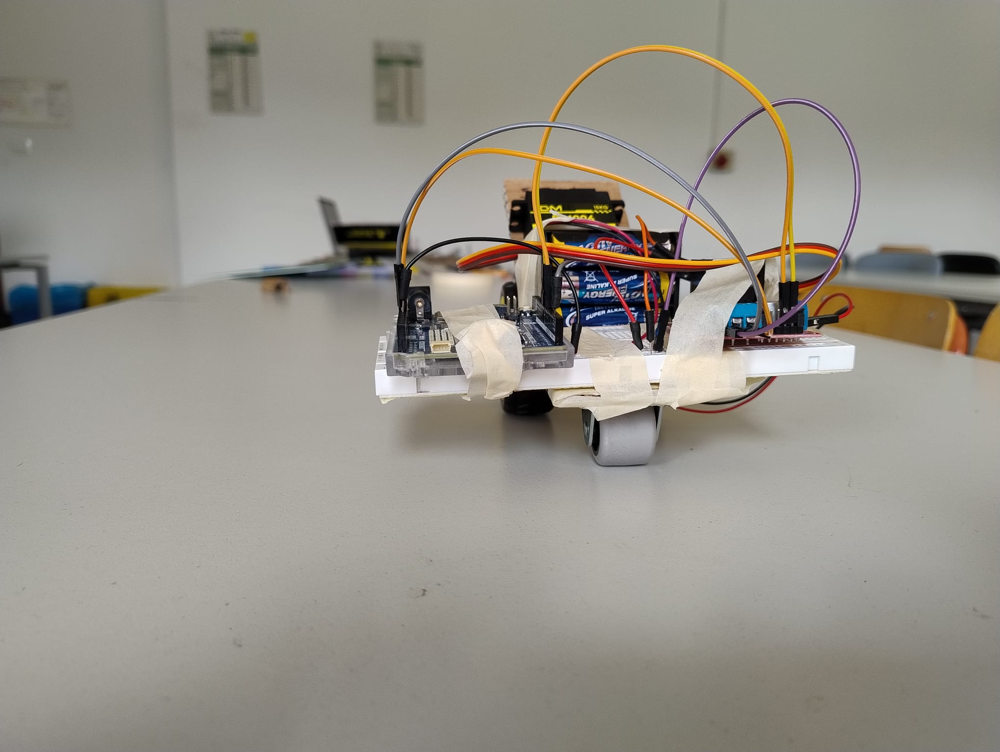
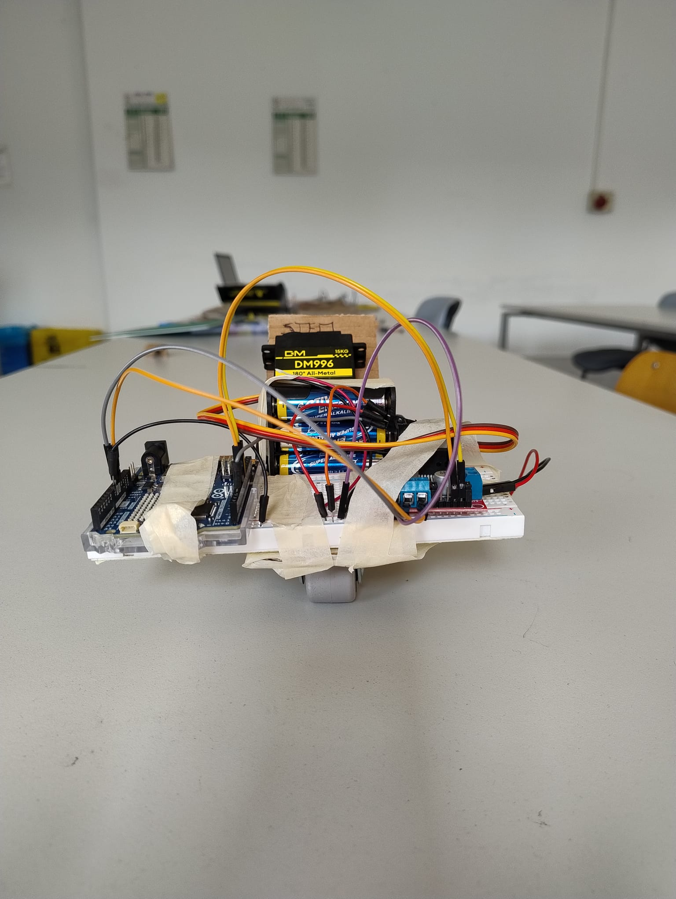

# 🤖 R-STEM – Robot Educativo Arduino

**R-STEM** è un piccolo robot realizzato dagli studenti durante il corso STEM, progettato per introdurre i concetti base di robotica, programmazione e meccanica in modo pratico e coinvolgente.

Il nome "R-STEM" unisce l'idea di *robot* con il cuore del progetto: le discipline **S**cience, **T**echnology, **E**ngineering, **M**athematics.

---

## 🔧 Componenti principali

- **Arduino Uno** – microcontrollore centrale
- **Motore DC 241216 G075** – per la trazione delle due ruote posteriori
- **Driver L298N** – per controllare la velocità e direzione del motore
- **Servomotore DM996** – per la sterzata della ruota anteriore
- **Plancia in cartone** – struttura leggera e personalizzabile
- **Alimentazione** – pacco batterie 6×AA o equivalente
- **Ruote + ingranaggi o cinghie** – per la trasmissione del moto

---

## ⚙️ Funzionamento

Il robot si muove grazie a un **singolo motore DC**, collegato a due ruote posteriori tramite un semplice sistema di trasmissione. La **ruota anteriore sterzante** è azionata da un **servomotore**, che permette al robot di cambiare direzione con precisione.

Tutti i componenti sono montati su una base in **cartone rigido**, progettata e tagliata dagli studenti.

---

## 💻 Codice di controllo

Il codice Arduino controlla:
- la **velocità e direzione del motore DC** tramite il driver L298N,
- l'**angolo di sterzata** della ruota anteriore via PWM al servomotore.

```cpp
#include <Servo.h>

Servo sterzo;
const int pinENA = 9;
const int pinIN1 = 8;
const int pinIN2 = 7;
const int pinServo = 3;

void setup() {
  pinMode(pinENA, OUTPUT);
  pinMode(pinIN1, OUTPUT);
  pinMode(pinIN2, OUTPUT);
  sterzo.attach(pinServo);
  sterzo.write(90); // Centro sterzo
}

void loop() {
  // Avanza
  digitalWrite(pinIN1, HIGH);
  digitalWrite(pinIN2, LOW);
  analogWrite(pinENA, 200);

  // Sterza a sinistra
  sterzo.write(60);
  delay(1000);

  // Sterza a destra
  sterzo.write(120);
  delay(1000);

  // Ritorna al centro
  sterzo.write(90);
  delay(1000);

  // Ferma
  analogWrite(pinENA, 0);
  delay(1000);
}
```
🎯 Obiettivi educativi

    Comprendere il funzionamento di motori e servo

    Usare il driver L298N

    Programmare con Arduino

    Sviluppare soluzioni meccaniche creative usando materiali semplici

    Lavorare in gruppo, seguendo un progetto concreto dall'idea alla realizzazione

📸 Galleria del progetto



✨ Ringraziamenti

Grazie a tutti gli studenti del corso STEM per l'entusiasmo, la creatività e la voglia di mettersi in gioco.
Il robot R-STEM è il risultato concreto di un apprendimento attivo e collaborativo!


